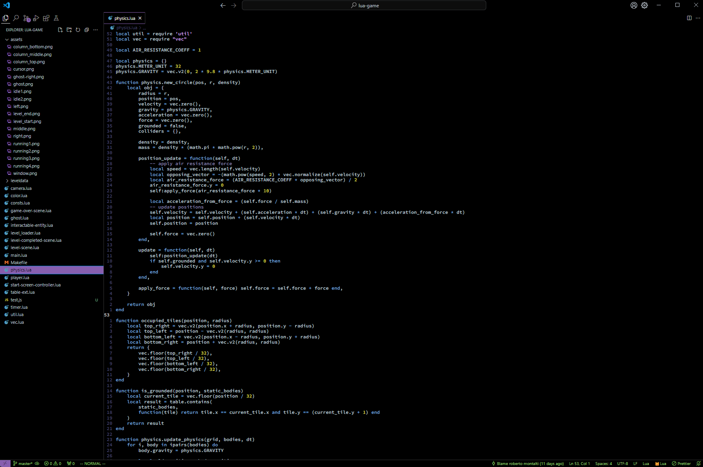

## Darkened

A simple dark theme for vscode inspired by this vim colorscheme [eva01](https://github.com/hachy/eva01.vim)



## Brightened

The light counterpart of Darkened. A white background with the same purple, green and blue accents.

## Install

### VS Code

Install the extension from the [marketplace](https://marketplace.visualstudio.com/items?itemName=rhighs.darkened), then pick **Darkened** or **Brightened** from the color theme picker (`Preferences: Color Theme`).

To build a VSIX from a checkout:

```bash
npx @vscode/vsce package
code --install-extension darkened-*.vsix
```

### OpenCode

The [`opencode/`](./opencode) directory contains OpenCode v2 themes for both variants. Copy them into the global themes directory:

```bash
mkdir -p ~/.config/opencode/themes
cp opencode/darkened.json opencode/brightened.json ~/.config/opencode/themes/
```

Restart OpenCode, run `/themes`, and pick `darkened` or `brightened`. To make one the default, set it in `~/.config/opencode/cli.json`:

```json
{
  "$schema": "https://opencode.ai/v2/cli.json",
  "theme": {
    "name": "brightened"
  }
}
```
